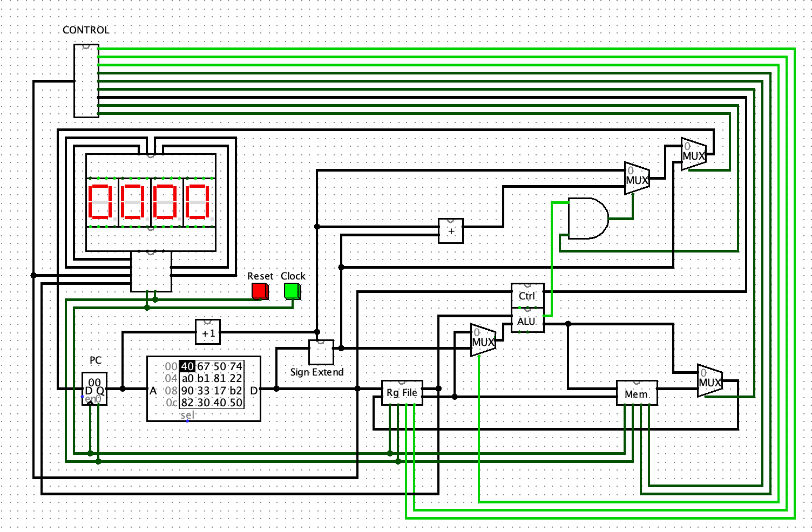
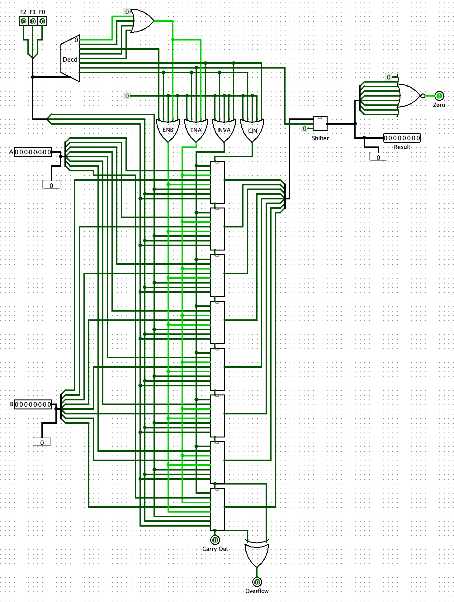

# Mini-MIPS

An 8-bit MIPS-like single-cycle CPU.

Overall design:


ALU design:


## Instruction Set Architecture

This simple 8-bit processor instruction set has two 8-bit registers (`$r0` and `$r1`) and an 8-bit program counter (PC).

Mini-MIPS has separate instruction memory and data memory. Each has maximum capacity of 256 bytes.

See  for more details about the ISA.

The instruction set contains:

### R-Type Instructions

```
and:    $rd = $rd & $rx
or:     $rd = $rd | $rx
not:    $rd = ($rx)`
xor:    $rd = $rd ^ $rx
add:    $rd = $rd + $rx
neg:    $rd = -($rx)
sll:    $rd = $rx << 1      (shift left logical)
sla:    $rd = $rx * 2       (shift left arithmetic)
```

### I-Type Instructions

```
lui     $r0, 0      # load upper immediate 4 bits of $r0 with all zeroes
sw      $r0, 0      $ store word in $r0 into memory at 0 address offset
lw      $r0, 0      $ load word from memory at 0 address offset into $r0
ori     $r1, 15     # bitwise or immediate between $r1 and 15 (F in hex)
disp    $r0, 0      # display the content of $r0 on 0th display unit of the 7-segment display
```

### J-Type Instructions

```
jump    5           # Jump by concatenating the address(5-bit) with the upper 3 bits of current value of PC.
beq     -1          # branch on equals ($r0 and $r1) to the offset -1 (i.e. halt in this case)
```

## Prerequisites

Install `Logisim`: https://www.cburch.com/logisim/

This circuit is tested to work with `logisim-generic-2.7.1.jar`.

## Running

Open `logisim` UI, then open the `miniMips.circ` file.

## Testing

Tests can be loaded from Logisim as ROM images. Use the CPU clock button to tick the
program counter. Or run the program using logisim UI.

Several tests are provided in `/rom-images` directory. For example:

```
v2.0 raw
00 40 6f 20 50 7f 31 ff
```

Below is a sample Display-and-Halt assembly program that can be converted to hex (see example above)
and loaded as a ROM image. The program loads `15` (`F` in hex) into register `$r0` for display.
We do the same for the `$r1` register. Then we branch by `beq -1` (i.e. halt). The result is to display
`FF` on the 7-segment display and stops the program.

```
lui     $r0, 0      # load upper 4 bits with all zeroes
ori     $r0, 15     # or with 15 (F in hex)
disp    $r0, 0      # display the content of $r0 on 0th display unit of the 7-segment display
lui     $r1, 0      # load upper 4 bits with all zeroes
ori     $r1, 15     # or with 15 (F in hex)
disp    $r1, 1      # display the content of $r1 on 1th display unit of the 7-segment display
beq     -1          # Halt
```
